# Student Navigator

Student Navigator is a professional, student-centric academic planning, learning management, career guidance, and placement-preparation platform built on the MERN stack. Designed to assist engineering and science students, the platform acts as a comprehensive curriculum roadmap builder, academic performance tracker, and opportunity explorer. It helps students navigate their university syllabus, practice coding challenges, attempt timed tests and quizzes, track their career readiness, discover scholarships and hackathons, and utilize a context-restricted AI study assistant as a supporting tool for conceptual clarification.

## Overview

### The Platform
Student Navigator serves as a unified digital ecosystem where academic syllabus progression directly informs career preparation. By integrating subject learning, hands-on programming practice, timed mock examinations, and opportunities discovery into a single dashboard, the platform removes fragmented resource hunting and brings structural clarity to the student's learning journey.

### The Purpose
The platform's main goal is to empower students with data-driven insights about their skill levels, syllabus coverage, and placement readiness. Rather than leaving students to guess if they are ready for technical interviews, Student Navigator tracks their activity logs across multiple academic dimensions, calculates a concrete **Career Readiness Score** using deterministic rules, and recommends target areas of improvement.

---

## Problem Statement

Modern university and technical college students face several critical roadblocks that hinder their academic growth and career preparation:

1. **Fragmented Learning Resources:** High-quality learning content (textbooks, reference tools, video playlists) is scattered across the internet, leading to cognitive fatigue and wasted study hours.
2. **Abstract Prerequisite Structures:** Students often struggle to understand the dependency relationships between subjects (e.g., why Linear Algebra must precede Machine Learning) and individual topics.
3. **Disconnected Prep & Academics:** Performance in university courses, timed mock tests, and programming platforms (LeetCode, GeeksforGeeks) are tracked in separate silos, hiding a student's actual career readiness.
4. **Placement Readiness Ambiguity:** Students lack a measurable metric to know if they are prepared for placement drives, technical screenings, or technical interviews.
5. **Undiscovered Opportunities:** Many eligible students miss out on scholarships, hackathons, and corporate competitions due to a lack of awareness and timely notifications.

---

## Solution

Student Navigator addresses these challenges through a structured, integrated, and secure platform:

* **Centralized Academic Syllabi:** Organizes core computer science and engineering subjects into a detailed roadmap of topics, conceptual notes, textbooks, and curated video playlists.
* **Interactive Prerequisite Graphs:** Visualizes subject and topic dependencies dynamically using interactive node graphs, showing students exactly what they need to master first.
* **Unified Performance Tracking:** Consolidates mock test percentages, quiz historical scores, assignments submitted, and coding problems solved into a singular learning profile.
* **Heuristic Career Readiness Metrics:** Calculates a data-driven, multi-factor **Career Readiness Score** (0–100) and displays a clear readiness level (Beginner to Placement Ready) along with an action checklist using deterministic algorithms.
* **Deterministic Career & Scholarship Matching:** Employs rule-based backend algorithms to suggest relevant career pathways and scholarships based on user profile criteria.
* **Optional AI Study Assistant:** Provides a supporting, context-restricted study chat assistant that keeps students focused on the specific subject and topic they are currently studying.

---

## Key Features

### 1. Learning & Academics
* **Syllabus & Curriculum Directory:** Covers a broad catalog of core engineering courses (including *Data Structures & Algorithms, Operating Systems, Database Management Systems, Generative AI, Aptitude & Reasoning, Object-Oriented Programming, Engineering Physics, and Mechanical Engineering*).
* **Topic-Level Details:** Breakdown of topics featuring definition briefs, textbooks, specialized software tools, and direct exam-oriented study tips.
* **Interactive Prerequisite Visualizers:** Leverages drag-and-drop dependency maps (built with **ReactFlow**) at both subject-to-subject and topic-to-topic levels to emphasize learning paths.
* **Curated Video Classrooms:** Embedded YouTube lecture playlists mapped to specific curricular topics for instant multimedia learning.

### 2. Practice & Assessment
* **Placement Mock Exams:** Standardized technical and aptitude mock tests with customizable timing parameters, automated instant grading, and historical record logs.
* **Conceptual Quizzes:** Short, topic-specific quizzes featuring interactive cards, instantaneous performance statistics, and detailed answers explaining correct options.
* **Coding Practice Catalog:** Mapped collection of coding problems categorized by topic, difficulty level (Easy, Medium, Hard), and direct links to live challenges on external platforms (LeetCode, HackerRank, GeeksforGeeks).
* **Assignments Workspace:** Track assignments, submission status, and completion history.

### 3. Career Development & Path Readiness
* **Career Exploration Profiles:** In-depth profiles for key technology roles (e.g., *AI/ML Engineer, Data Scientist, Frontend Developer, Backend Developer, Cloud Architect*) outlining essential, important, and good-to-have skillsets.
* **Career Roadmaps:** Phase-by-phase pathway maps showing the exact topics and skills required to reach specific career outcomes.
* **Heuristic Career Matcher:** A backend service that cross-references a student's technical skills, interests, and topic completion rates to suggest matching career paths. *This matching process is fully deterministic and runs on database rules independent of the AI assistant.*
* **Career Readiness Score:** Computes a weighted performance score across five categories using deterministic scoring logic:
  * **Curriculum Coverage (Syllabus completion):** Up to **30%**
  * **Conceptual Mastery (Quiz average):** Up to **20%**
  * **Algorithmic Practice (Coding solved):** Up to **20%**
  * **Timely Submissions (Assignments completed):** Up to **10%**
  * **Mock Exam Performance (Test average):** Up to **20%**

### 4. Opportunities Board
* **Scholarship Explorer:** Database of active scholarships (e.g., from *Buddy4Study, Vidyasaarathi, Government Portals*) with filters matching student demographics, CGPA, state residency, and annual family income.
* **Application Tracker:** Lets students save, monitor, and track their application progress with deadline indicators.
* **Technical Events Calendar:** Regularly updated schedule of upcoming global/national student hackathons, coding contests, and corporate events (e.g., *Microsoft Imagine Cup*).

### 5. Progress & Gamification
* **Analytics Dashboard:** Visual representation of student performance trends over time using **Recharts** (e.g., mock test scores, topic completion rates, quiz averages).
* **Streaks Tracking:** Monitors consecutive days of learning activity to build consistent study habits.
* **Milestone Achievements:** Gamified badge system that unlocks credentials when milestones are met (e.g., first quiz completed, 10 coding challenges solved).

### 6. AI Study Assistant (Supporting Module)
* **Optional Chat Assistant:** A chatbot powered by the **Llama 3.3 70B** model via the **Groq API**, serving as an optional study companion.
* **Educational Scoping:** Configured as a virtual Computer Science professor. The assistant classifies questions into:
  * *Category A (Current Topic):* Responds with full, structured explanations.
  * *Category B (Related Topic):* Provides a brief connection and guides the student to that topic's page in the syllabus.
  * *Category C (Out of Scope):* Friendly reminder to keep questions focused on the subject at hand.
* **Meta-Analysis Outputs:** Automatically estimates reading times, gauges difficulty levels, and suggests three next-step follow-up questions.
* **AI Notes Integration:** Lets students save helpful chatbot responses directly into their personal notes, automatically grouped by subject and topic.

---

## System Architecture

Student Navigator is designed as a classic multi-tier architecture with separate frontend and backend layers to enforce separation of concerns:

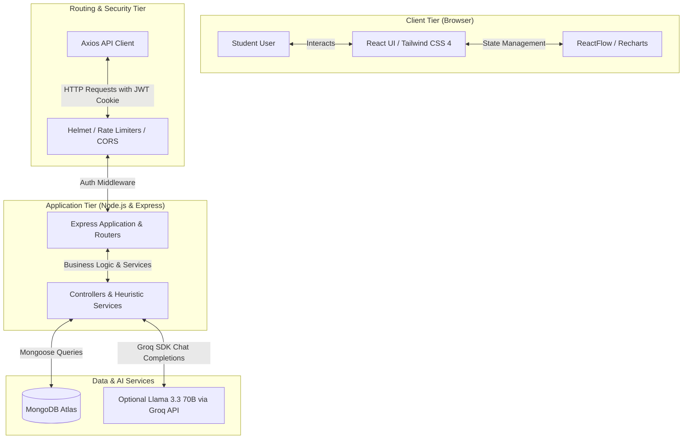

### Technology Stack
* **Frontend:** React 19, Vite 8, Tailwind CSS v4, React Router DOM v7, ReactFlow v11, Recharts v3, Lucide React, Axios.
* **Backend:** Node.js, Express.js v5, Mongoose v8, JWT, BcryptJS, Cookie Parser, Express Rate Limit, Helmet, Morgan, Nodemailer.
* **Database:** MongoDB Atlas (NoSQL Document Store).

---

## Screenshots

### Dashboard
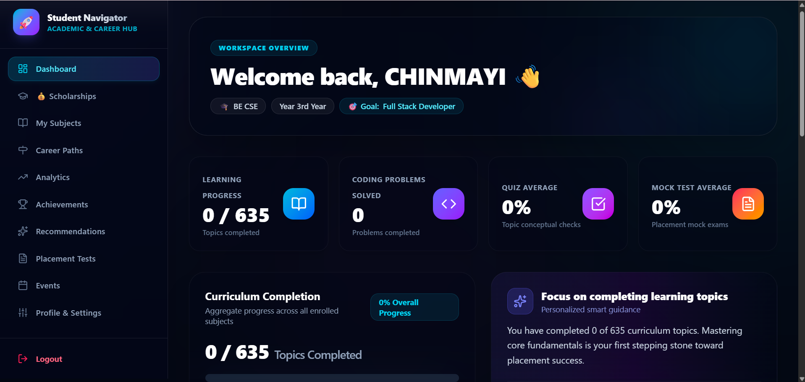
*The student dashboard showing curriculum progress, coding problems solved, quiz average, and placement mock test scores — all at a glance.*

### Subjects & Curriculum
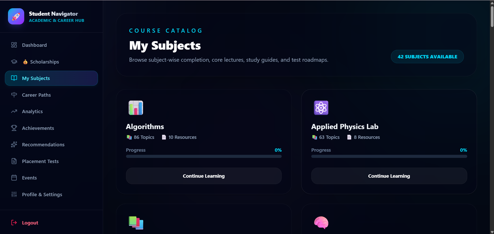
*The course catalog listing 42 engineering subjects with topic counts, resource counts, and individual subject progress bars.*

### Subject Syllabus Roadmap
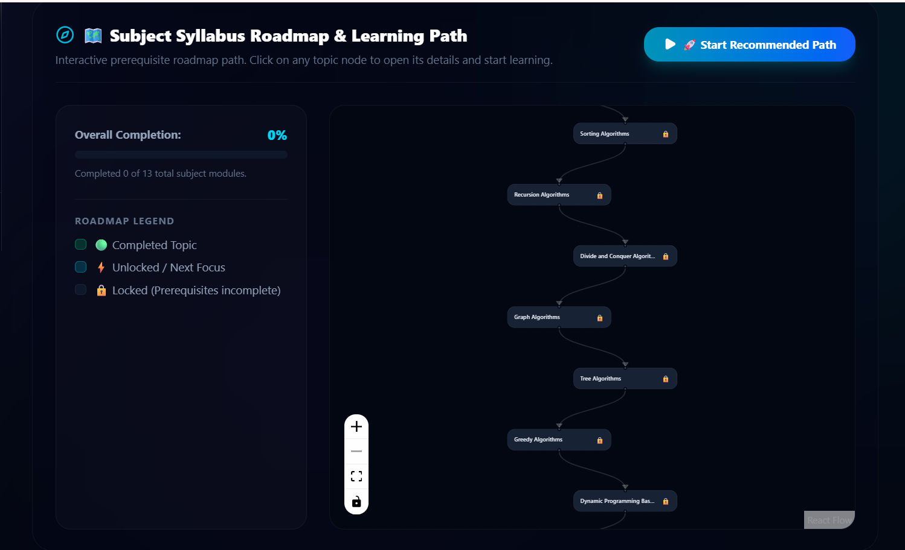
*Interactive prerequisite dependency map built with ReactFlow. Topics are locked until their prerequisites are completed, guiding students along the correct learning path.*

### Topic Details
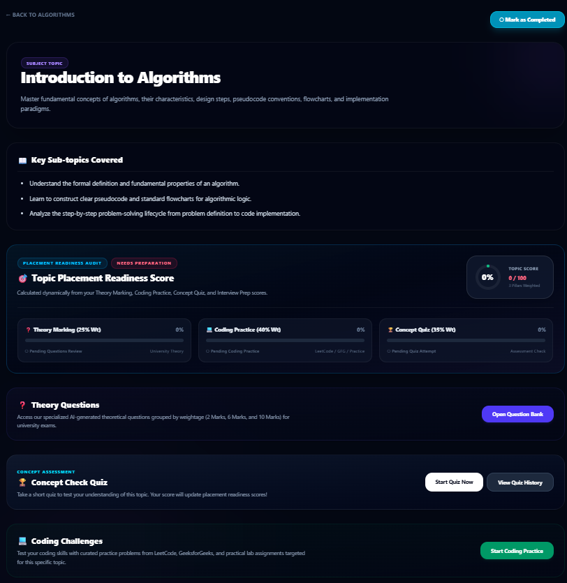
*Detailed topic page showing key sub-topics, a dynamically calculated Topic Placement Readiness Score, theory questions, concept quiz, and coding challenges — all in one view.*

### Coding Practice
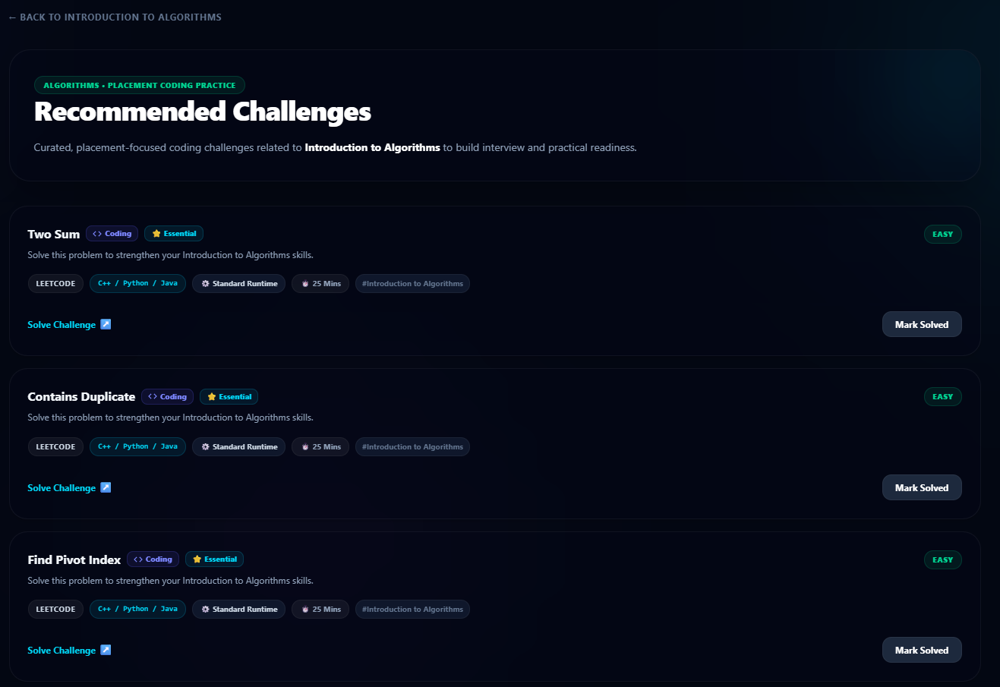
*Curated placement-focused coding challenges mapped to each topic, with difficulty labels, platform links (LeetCode, HackerRank), language tags, and a "Mark Solved" tracker.*

### Concept Quiz
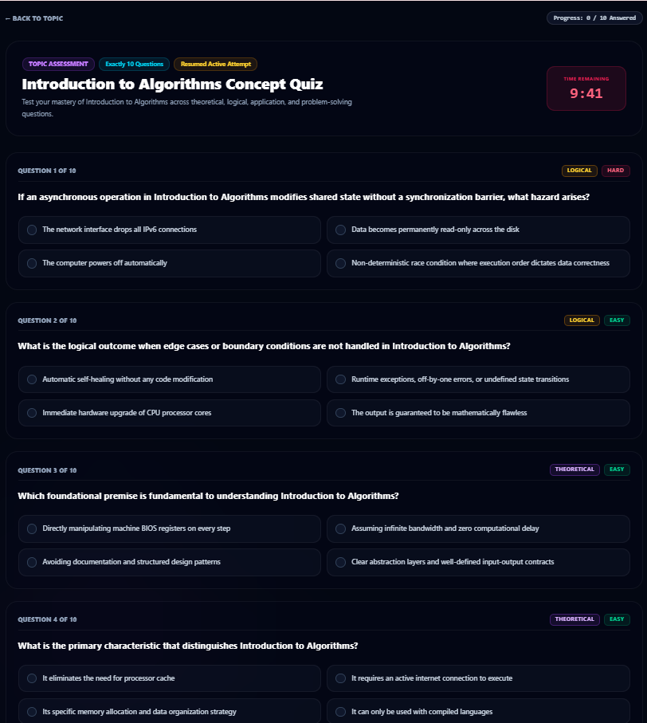
*Timed topic concept quiz with 10 questions, difficulty tagging (Logical / Theoretical), and a live countdown timer to simulate exam conditions.*

### Placement Mock Exams
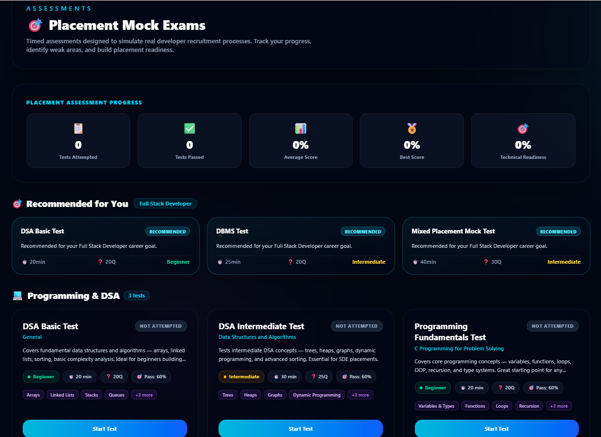
*Placement mock exam center with career-goal-based recommendations, test metadata (duration, questions, pass mark), and topic-wise subject groupings.*

### Career Recommendations
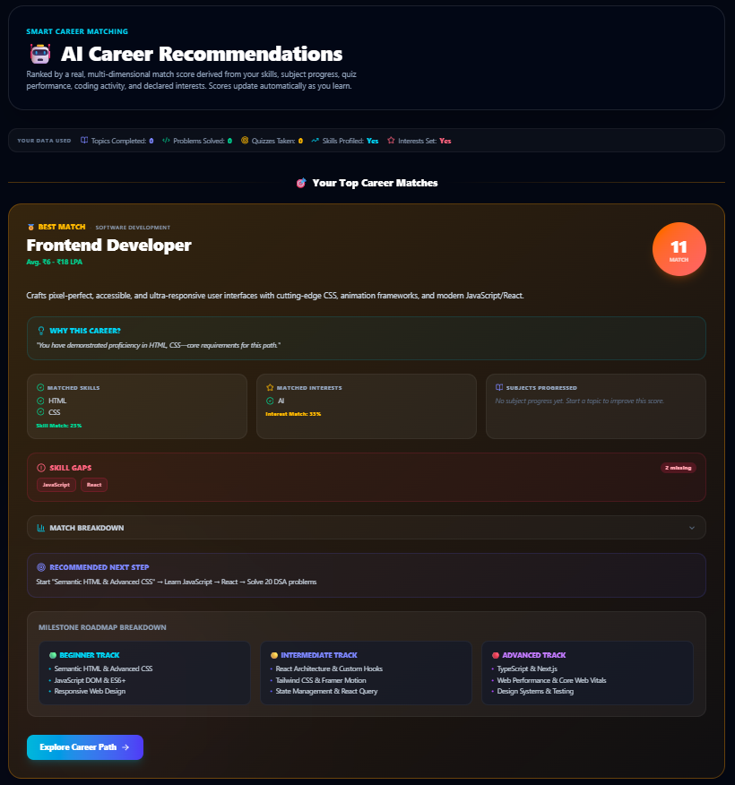
*Heuristic career matcher showing top career matches ranked by skill overlap, interest alignment, and subject progress. Includes matched skills, skill gaps, and a recommended learning next step.*

### Scholarship Finder
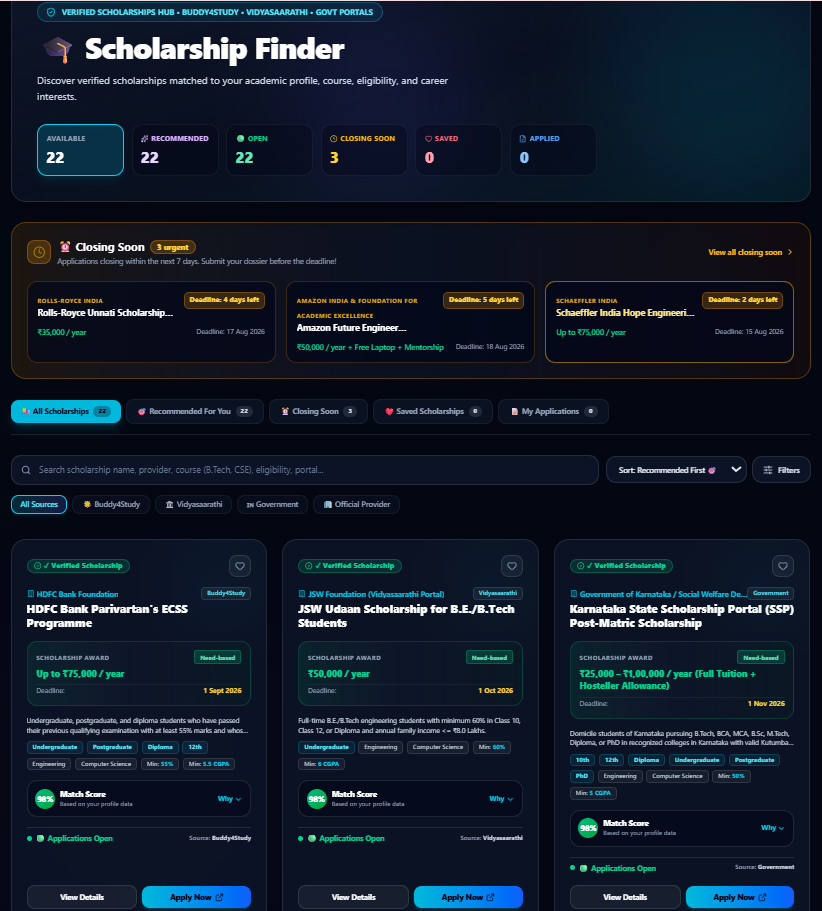
*Verified scholarship discovery hub aggregating opportunities from Buddy4Study, Vidyasaarathi, and Government portals — with urgency indicators, match scores, and direct "Apply Now" links.*

### Learning Analytics & Metrics
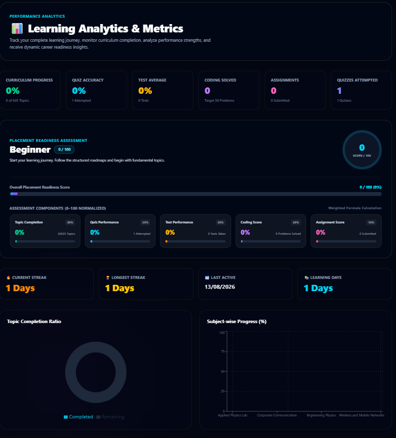
*Performance analytics dashboard showing curriculum completion, quiz accuracy, test averages, coding activity, streak counters, and a weighted Placement Readiness Score breakdown.*

### AI Study Assistant
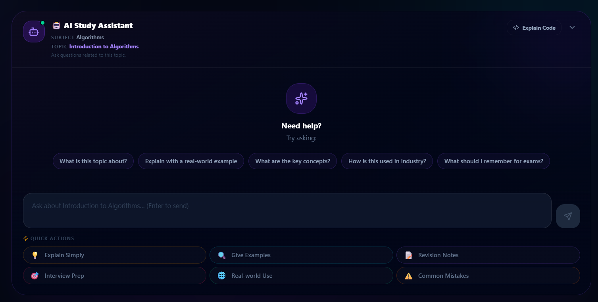
*Context-restricted AI study assistant scoped to the current subject and topic. Powered by Llama 3.3 70B via the Groq API, with quick-action prompts for revision notes, interview prep, and real-world use explanations.*

---

## Installation & Setup

### Prerequisites
* Node.js (v18.x or higher)
* MongoDB (Local instance or MongoDB Atlas Connection URI)
* Groq API Key (required if enabling the optional AI Assistant feature)

### Step-by-Step Installation

1. **Clone the Repository:**
   ```bash
   git clone https://github.com/Chinmayinarayan/Student-Navigator.git
   cd Student-Navigator
   ```

2. **Configure Backend Environment Variables:**
   Navigate to the `server` directory, create a `.env` file, and populate the following properties:
   ```env
   PORT=5000
   MONGODB_URI=your_mongodb_connection_string
   JWT_SECRET=your_jwt_signing_secret
   GROQ_API_KEY=your_groq_api_key
   NODE_ENV=development
   CLIENT_URL=http://localhost:5173
   ```

3. **Install Dependencies & Seed Database:**
   ```bash
   # In root directory, navigate to server
   cd server
   npm install
   
   # Seed the subject, topic, event, and career databases
   npm run seed
   
   # Start the development server
   npm run dev
   ```

4. **Setup Frontend Client:**
   Open a separate terminal window, navigate to the `client` directory, and start the development server:
   ```bash
   cd client
   npm install
   npm run dev
   ```

5. **Access the Application:**
   Open your browser and navigate to `http://localhost:5173`.
   > **Note:** If port 5173 is already in use on your machine, Vite automatically picks the next available port (e.g. 5174). The terminal output will show the exact URL.

---

## Project Structure

```
Student-Navigator/
├── client/                      # React 19 + Vite frontend
│   ├── public/                  # Static assets
│   └── src/
│       ├── components/          # Reusable UI components
│       │   ├── AIStudyAssistant.jsx
│       │   ├── CareerReadinessCard.jsx
│       │   ├── SubjectPrerequisiteGraph.jsx
│       │   ├── TopicPrerequisiteGraph.jsx
│       │   └── ...              # Layout, Sidebar, Quiz, Topic cards etc.
│       ├── pages/               # Route-level page components
│       │   ├── Dashboard.jsx
│       │   ├── Subjects.jsx
│       │   ├── TopicDetails.jsx
│       │   ├── Careers.jsx
│       │   ├── Scholarships.jsx
│       │   ├── AnalyticsDashboard.jsx
│       │   ├── Tests.jsx
│       │   └── ...
│       ├── services/            # Axios API client modules (one per domain)
│       ├── context/             # React auth context
│       └── main.jsx
│
├── server/                      # Node.js + Express backend
│   ├── controllers/             # Route handler logic (23 controllers)
│   ├── routes/                  # Express route definitions (23 route files)
│   ├── models/                  # Mongoose schemas (21 models)
│   ├── services/                # Business logic services
│   │   ├── careerReadinessService.js   # Deterministic readiness scoring
│   │   ├── recommendationService.js    # Heuristic career matching
│   │   ├── roadmapGeneratorService.js  # Career roadmap generation
│   │   ├── quizGeneratorService.js
│   │   └── achievementService.js
│   ├── middleware/              # Auth, error handling, rate limiting
│   ├── config/                  # Database connection
│   ├── utils/                   # JWT generation, email utilities
│   ├── seed/                    # Database seeder scripts
│   ├── test/                    # Jest test suites
│   │   ├── auth.test.js         # Authentication & registration tests
│   │   ├── businessLogic.test.js # Career readiness, quiz scoring tests
│   │   ├── securityAndRbac.test.js # JWT, IDOR, RBAC, path traversal tests
│   │   └── quizSystemTest.js
│   ├── app.js                   # Express application setup
│   └── server.js                # Entry point
│
├── docs/
│   └── screenshots/             # Application screenshots (12 screens)
│
├── .github/
│   └── workflows/
│       └── ci.yml               # GitHub Actions CI (Jest test suite)
│
├── .gitignore
└── README.md
```

---

## Running Tests

The backend includes a Jest test suite covering authentication, core business logic, and security/access-control:

```bash
cd server
npm test
```

**Test suites included:**

| Suite | Coverage |
|-------|----------|
| `auth.test.js` | Registration validation, login, duplicate email rejection |
| `businessLogic.test.js` | Career Readiness Score calculation, scholarship matching, quiz scoring |
| `securityAndRbac.test.js` | JWT validation, IDOR prevention, admin RBAC, path traversal blocking, AI prompt validation |
| `quizSystemTest.js` | Quiz generation and answer evaluation |

> Tests run in isolation (`--runInBand --forceExit`) and require a test MongoDB instance or mocked connections depending on suite configuration.

---

## Troubleshooting

| Problem | Likely Cause | Fix |
|---------|-------------|-----|
| `MongoServerError: connect ECONNREFUSED` | Invalid `MONGODB_URI` or network issue | Verify Atlas URI includes credentials and correct cluster name |
| `JsonWebTokenError: invalid signature` | Mismatched `JWT_SECRET` | Ensure `server/.env` has a consistent, strong JWT secret |
| Backend starts but returns 500 on all routes | Missing `.env` variables | Check all required env vars are set in `server/.env` |
| Frontend shows blank page / no data | Backend not running or CORS mismatch | Confirm backend is running on port 5000; check `CLIENT_URL` in `.env` |
| Port 5173 already in use | Another process using the port | Vite will auto-assign the next free port (usually 5174); check terminal output |
| `GROQ_API_KEY` errors | Missing or invalid Groq key | Obtain a free key from [console.groq.com](https://console.groq.com); the platform works without it except for the AI Study Assistant |
| Database is empty after setup | Seeder not run | Run `npm run seed` from the `server/` directory |

---

## License

This project does not currently have a formal open-source license. All rights are reserved by the author. If you wish to use, fork, or build upon this project, please contact the repository owner.

---

## Contributing

This is a personal academic and portfolio project. If you spot a bug or have a suggestion, feel free to open an issue on [GitHub](https://github.com/Chinmayinarayan/Student-Navigator/issues).

---

*Student Navigator — Built for engineering students preparing for placements, internships, and academic excellence.*
